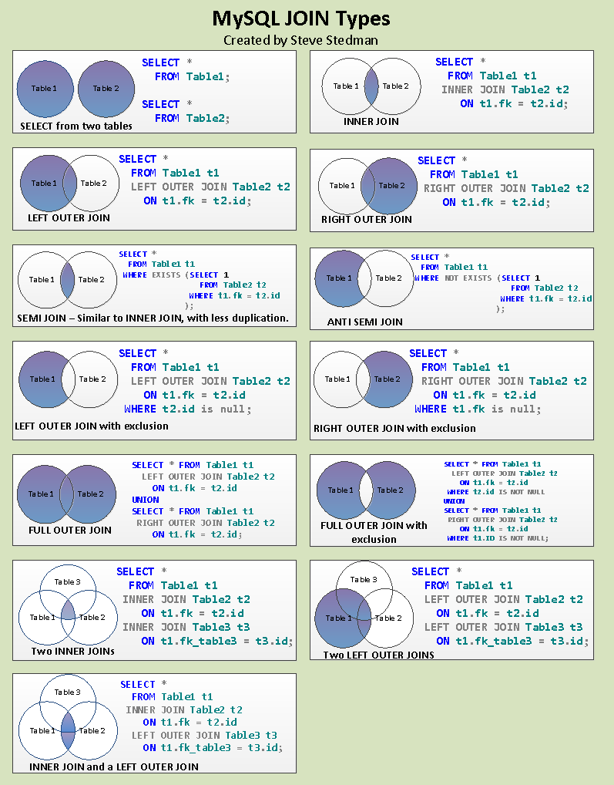

## SQL Basics

## SQL Command Types

### DDL 

Data Definition Language

* Create
* Alter
* Drop
* Rename
* Insert
* Update
* Delete
* Merge
* Truncate

### DCL 

Data Control Language

* Grant
* Revoke

### DQL 

Data Query Language

* Select

### DML 

Data Manipulation Language

* Insert
* Update
* Delete
* Merge

Here SQL all diagram

## SQL Join

Here SQL all Join query diagram

## Online SQL learning resources

1. [SQL Bolt](https://sqlbolt.com/)